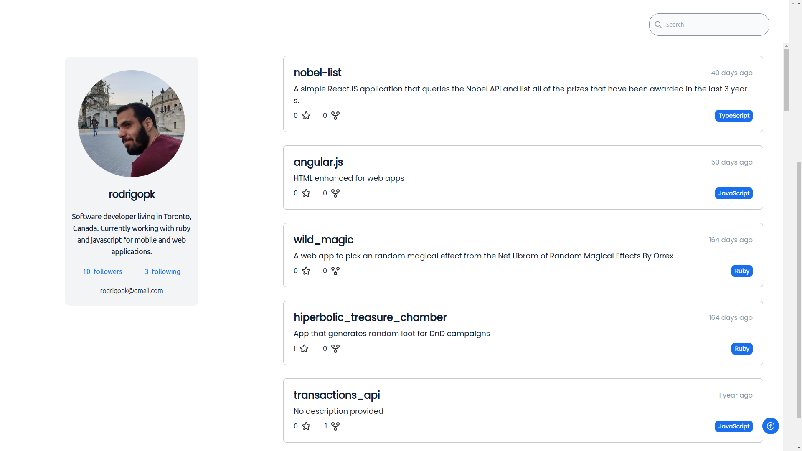
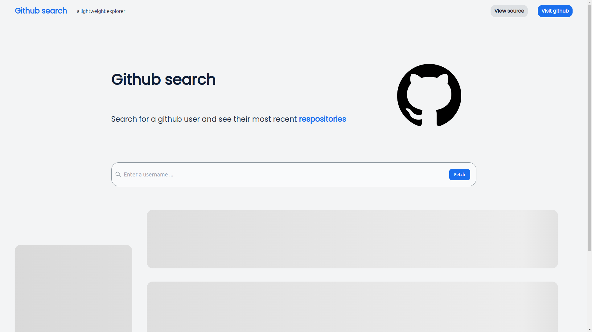

<div align="center">
  <h1 align="center">Github Repositories Fetch</h1>

  <p align="center">
    A minimalistic explorer for searching through github repositories
    <br />
    <br />
    <a href="">View Demo</a>
    ·
    <a href="https://github.com/gharbiamine/github-GQL-API-search/issues">Report Bug</a>
    ·
    <a href="https://github.com/gharbiamine/github-GQL-API-search/issues">Request Feature</a>
  </p>
</div>

<!-- TABLE OF CONTENTS -->
<details>
  <summary>Table of Contents</summary>
  <ol>
    <li>
      <a href="#introduction">Introduction</a>
      <ul>
        <li><a href="#technologies">Technologies</a></li>
      </ul>
    </li>
    <li>
      <a href="#getting-started">Getting Started</a>
      <ul>
        <li><a href="#prerequisites">Prerequisites</a></li>
        <li><a href="#installation">Installation</a></li>
      </ul>
    </li>
    <li><a href="#usage">Usage</a></li>
    <li><a href="#roadmap">Roadmap</a></li>
  </ol>
</details>

<!-- ABOUT THE PROJECT -->

## About The Project




With the release of the new github V4 GraphQL API, this application is bascially an explorer built on top of that with the goal of making it easy to search through the github repositories of a given user and getting the information you need.

How is this different than any other explorer ?:

- The design is minimalistic and easy to use
- Fully responsive and supports all screen sizes
- The application is built using React.js + Vite allowing for fast build times and a great developer experience

### Built With

This project is made using :

- [React.js](https://reactjs.org/)
- [Typescript](https://www.typescriptlang.org/)
- [Vite](https://vitejs.dev/)
- [TailwindCSS](https://tailwindcss.com/)
- [GraphQL](https://graphql.org/)
- [Storybook](https://storybook.js.org/)
- [Jest](https://jestjs.io/)

<!-- GETTING STARTED -->

## Getting Started

Follow these steps to get a local copy up and running.

### Prerequisites

You will need latest npm version installed on your machine

- npm
  ```sh
  npm install npm@latest -g
  ```

### Installation

1. Clone the repo
   ```sh
   git clone https://github.com/gharbiamine/github-GQL-API-search/
   ```
2. Install NPM packages
   ```sh
   npm install
   ```

<!-- USAGE EXAMPLES -->

## Usage

1. Get a github personal access token from [here](https://docs.github.com/en/github/authenticating-to-github/keeping-your-account-and-data-secure/creating-a-personal-access-token)

2. Create a .env file and type the following inside

   ```sh
   // contents of .env
   VITE_APP_BASE_URL ="https://api.github.com/graphql"
   VITE_APP_GITHUB_PUBLIC_API_KEY ="your_github_personal_access_token"
   ```

3. Serve the project to a development server
   ```sh
   npm run start
   ```

<!-- Testing -->

## Testing

To run the test suite run this command

```sh
npm run test
```

<!-- Storybooks -->

## Storybooks

Start Storybooks

```sh
npm run storybook
```

<!-- ROADMAP -->

## Roadmap

- [x] Add a loader
- [x] Create unit tests using jest
- [ ] Add more filters for the search
- [ ] Add a dark mode theme
- [ ] Add i18n support
- [ ] Add infinite scrolling

See the [open issues](https://github.com/gharbiamine/github-GQL-API-search/issues) for a full list of proposed features (and known issues).

## Contact

Project Link: [https://github.com/Dopeamin/github-repositories-fetch](https://github.com/Dopeamin/github-repositories-fetch)

## Feedback

This coding challenge was a great opportunity for me to experiment with new technologies and brush up on some old ones. Although the timeline has been a bit challenging to keep up with I wasn able to acquire a lot of valuable knowledge and experience that i can hopefully project into feature endeavours. I would love to hear your feedback on the project and how i can improve it in the future.
